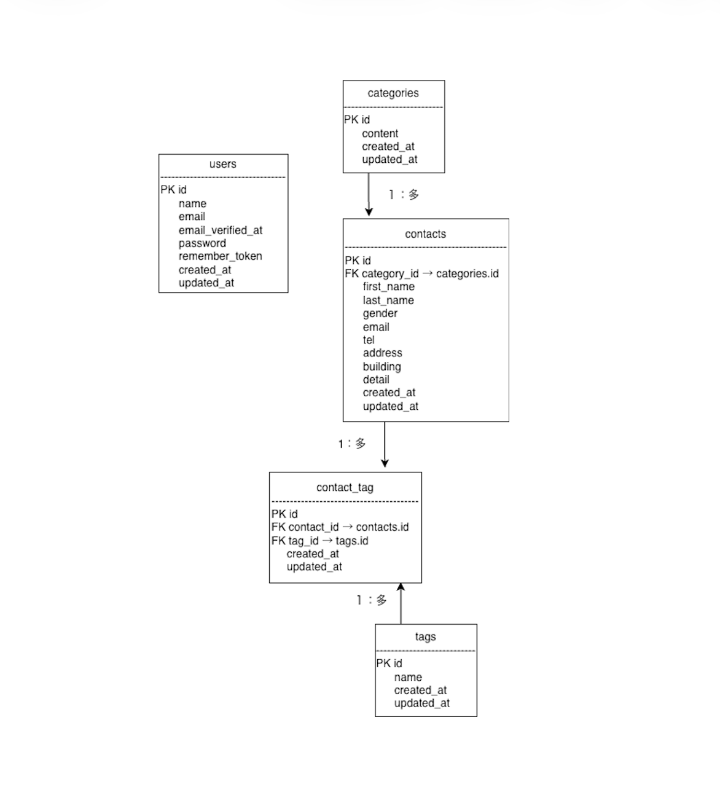

# COACHTECH お問い合わせフォーム

## 概要
本プロジェクトは、ユーザーがお問い合わせを送信し、管理者がお問い合わせ内容を管理できるお問い合わせフォームアプリです。

公開側ではお問い合わせ入力・確認・送信機能を実装し、管理側ではログイン認証後、お問い合わせ一覧表示、検索、詳細表示、削除、タグ管理、CSVエクスポート機能を実装しています。


### 実装機能

- お問い合わせ入力
- 入力内容確認
- お問い合わせ登録
- サンクスページ表示
- 管理者ログイン（Laravel Fortify）
- お問い合わせ一覧表示
- お問い合わせ詳細表示
- お問い合わせ検索
  - キーワード（氏名・メールアドレス）
  - 性別
  - カテゴリ
  - 日付
- お問い合わせ削除
- タグ追加
- タグ編集
- タグ削除
- CSVエクスポート（検索条件対応）

---

## ER図



---

## 環境構築

### 1. Laravelプロジェクトを作成

Laravel 10.x のプロジェクトを作成します。

```bash
docker run --rm \
    -u "$(id -u):$(id -g)" \
    -v "$(pwd):/var/www/html" \
    -w /var/www/html \
    -e COMPOSER_CACHE_DIR=/tmp/composer_cache \
    laravelsail/php82-composer:latest \
    composer create-project laravel/laravel:^10.0 contact-form-app
```

### 2. Laravel Sailをインストール

プロジェクトディレクトリへ移動します。

```bash
cd contact-form-app
```

Laravel Sailをインストールします。

```bash
docker run --rm \
    -u "$(id -u):$(id -g)" \
    -v "$(pwd):/var/www/html" \
    -w /var/www/html \
    -e COMPOSER_CACHE_DIR=/tmp/composer_cache \
    laravelsail/php82-composer:latest \
    composer require laravel/sail --dev
```

MySQL環境でLaravel Sailの設定を行います。

```bash
docker run --rm \
    -u "$(id -u):$(id -g)" \
    -v "$(pwd):/var/www/html" \
    -w /var/www/html \
    -e COMPOSER_CACHE_DIR=/tmp/composer_cache \
    laravelsail/php82-composer:latest \
    php artisan sail:install --with=mysql
```

> **Apple Silicon（M1/M2/M3）をご利用の場合**
>
> `compose.yaml` の `mysql` サービスに以下を追加してください。
>
> ```yaml
> platform: 'linux/amd64'
> ```

### 3. `.env` ファイルを設定

`.env` ファイルのデータベース接続情報を以下のように設定してください。

```env
DB_CONNECTION=mysql
DB_HOST=mysql
DB_PORT=3306
DB_DATABASE=laravel
DB_USERNAME=sail
DB_PASSWORD=password
```

> **注意**
>
> `DB_HOST` は `localhost` や `127.0.0.1` ではなく、Dockerコンテナ名である `mysql` を指定してください。

### 4. フロントエンドのセットアップ（Vite / Tailwind CSS）

#### NPMパッケージをインストール

> **事前にSailコンテナを起動してください。**

```bash
sail npm install
```

#### Tailwind CSS・Alpine.jsをインストール

```bash
sail npm install -D tailwindcss@^3.4.0 postcss autoprefixer
sail npm install alpinejs
```

#### Tailwind CSSの設定ファイルを生成

```bash
sail npx tailwindcss init -p
```

#### `tailwind.config.js`を設定

```js
/** @type {import('tailwindcss').Config} */
export default {
  content: [
    "./resources/**/*.blade.php",
    "./resources/**/*.js",
    "./resources/**/*.vue",
  ],
  theme: {
    extend: {},
  },
  plugins: [],
}
```

#### 提供されたBladeファイルを配置

提供されたBladeテンプレートを利用するため、`resources`ディレクトリを配布リポジトリのものに置き換えます。

```bash
git clone https://github.com/coachtech-prepared-file/Preparedblade-ConfirmationTest-ContactForm.git
```

#### Vite開発サーバーを起動

```bash
sail npm run dev
```

> **注意**
>
> `sail npm run dev` は開発中、終了せずに起動したままにしてください。

### 5. phpMyAdminを追加

`compose.yaml` の `mysql` サービスの後に、以下の設定を追加してください。

```yaml
phpmyadmin:
    image: 'phpmyadmin:latest'
    ports:
        - '${FORWARD_PHPMYADMIN_PORT:-8080}:80'
    environment:
        PMA_HOST: mysql
        PMA_USER: '${DB_USERNAME}'
        PMA_PASSWORD: '${DB_PASSWORD}'
    networks:
        - sail
    depends_on:
        - mysql
```

### 6. Laravel Sailを起動

Sailコンテナを起動します。

```bash
./vendor/bin/sail up -d
```

必要に応じて、Sailを簡単に実行できるようエイリアスを設定します。

**zsh**

```bash
echo "alias sail='[ -f sail ] && bash sail || bash vendor/bin/sail'" >> ~/.zshrc
```

**bash**

```bash
echo "alias sail='[ -f sail ] && bash sail || bash vendor/bin/sail'" >> ~/.bashrc
```

設定後は、シェルを再起動するか以下を実行して反映します。

```bash
exec $SHELL
```

### 7. アプリケーションキーを生成

プロジェクトのルートディレクトリで、以下のコマンドを実行します。

```bash
sail artisan key:generate
```

### 8. データベースのマイグレーションとシーディング

```bash
sail artisan migrate --seed
```

データベースを初期化する場合

```bash
sail artisan migrate:fresh --seed
```

> 日本語化は `FormRequest` の `messages()` および `lang/ja` を使用しています。

---

## 使用技術
- PHP 8.x
- Laravel 10.x
- MySQL 8.0
- Docker
- Laravel Sail
- Nginx
- Laravel Fortify
- Tailwind CSS
- Alpine.js
- PHPUnit
- Laravel Pint

---

## APIエンドポイント一覧

本プロジェクトでは公開API（応用課題）は未実装です。

---

## 開発環境URL

- 公開側: http://localhost

- 管理画面ログイン: http://localhost/login

- 管理画面: http://localhost/admin

---

## テストアカウント

| 項目 | 値 |
|------|----|
| Email | test@example.com |
| Password | password |

---

## 作成者

坂本 幸子